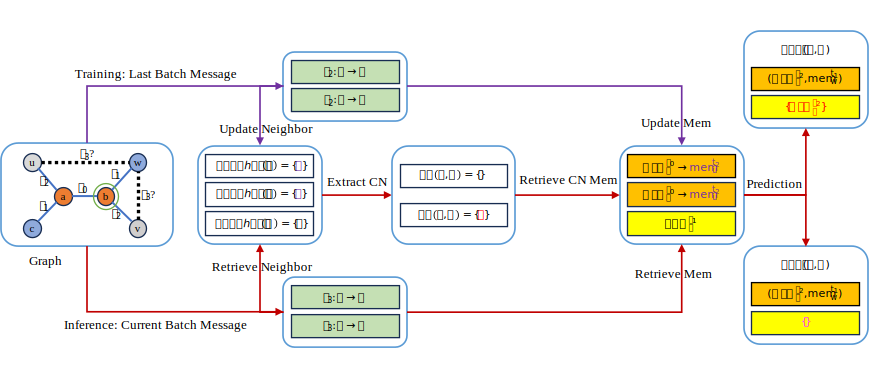

<!-- # TNCN -->
# Efficient Neural Common Neighbor for Temporal Graph Link Prediction

### Overview


### Scripts

* Example of utilizing 1-hop TNCN to perform the dynamic link prediction on *tgbl-wiki* dataset:
```
python examples/linkproppred/tgbl-dataset/TNCN.py --data tgbl-wiki --hop_num 1 --NCN_mode 1
```

* Arguments for multi-hop NCN choices:
```
0&1 hop: hop_num=1, NCN_mode=0

1 hop: hop_num=1, NCN_mode=1 (default)

0~2 hop: hop_num=2, NCN_mode=2 
```

### Acknowledgments

We appreciate the authors of [TGB](https://github.com/shenyangHuang/TGB) for making their project codes and datasets publicly available. We are also grateful to [TGB_Baselines](https://github.com/fpour/TGB_Baselines) and [DyGLib](https://github.com/yule-BUAA/DyGLib) authors that we conduct experiments on the baselines adapted from their implementations.

### Citation

If code from this repo is useful for your project, please consider citing our paper:
```
@misc{zhang2024efficient,
      title={Efficient Neural Common Neighbor for Temporal Graph Link Prediction}, 
      author={Xiaohui Zhang and Yanbo Wang and Xiyuan Wang and Muhan Zhang},
      year={2024},
      eprint={2406.07926},
      archivePrefix={arXiv},
      primaryClass={id='cs.LG' full_name='Machine Learning' is_active=True alt_name=None in_archive='cs' is_general=False description='Papers on all aspects of machine learning research (supervised, unsupervised, reinforcement learning, bandit problems, and so on) including also robustness, explanation, fairness, and methodology. cs.LG is also an appropriate primary category for applications of machine learning methods.'}
}
```

### Install dependency
Our implementation works with python >= 3.9 and can be installed as follows

1. set up virtual environment (conda should work as well)
```
python -m venv ~/tgb_env/
source ~/tgb_env/bin/activate
```

2. install external packages
```
pip install pandas==1.5.3
pip install matplotlib==3.7.1
pip install clint==0.5.1
```

install Pytorch and PyG dependencies (needed to run the examples)
```
pip install torch==2.0.0 --index-url https://download.pytorch.org/whl/cu117
pip install torch_geometric==2.3.0
pip install torch_scatter torch_sparse torch_cluster torch_spline_conv -f https://data.pyg.org/whl/torch-2.0.0+cu117.html
```

3. install local dependencies under root directory `/TNCN`
```
pip install -e .
```

4. install py-tgb dependency
```
pip install py-tgb
```